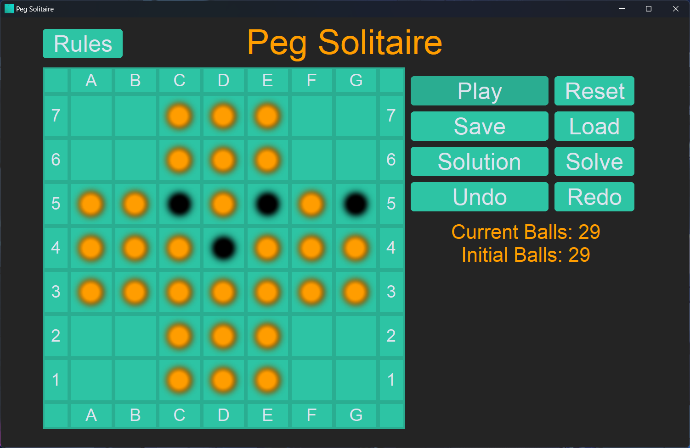
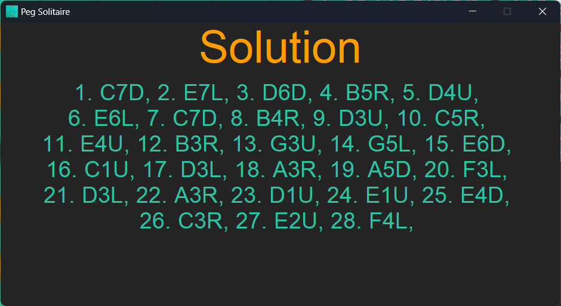

= Peg Solitaire

Simple peg solitaire game written in python using customtkinter library.

== Run
    - Install dependencies

    pip install -r requirements.txt

    - Run the game

    python -m src.main

== Game

=== Example:

{empty} +

To get the rules of the game, click on the `Rules` button in the upper left corner.

Fill the board with pegs then press `Play` to start the game. +
Select a peg and click on the destination cell to move the peg.

You can:
[disk]
 - restart the board by pressing the `Restart` button. +
 - save the current board by pressing the `Save` button. +
 - load a saved board by pressing the `Load` button. +
 - get solution by pressing the `Solution` button. +
 - solve the board by pressing the `Solve` button. +
 - undo the last move by pressing the `Undo` button or `ctrl + z`. +
 - redo the last move by pressing the `Redo` button or `ctrl + y`. +

=== How the solution notation works:

For example let's take solution of the previously shown board: +

{empty} +

We will discuss the first move of the solution `C7D`: +
The first two characters `C7` represent the peg that will be moved. +
The last character `D` represents the direction of the move.

The direction is represented by the following characters:
[disk]
 - `U` for up +
 - `D` for down +
 - `L` for left +
 - `R` for right +
